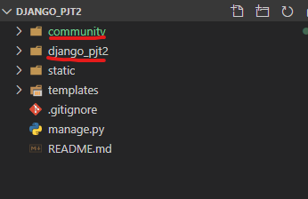
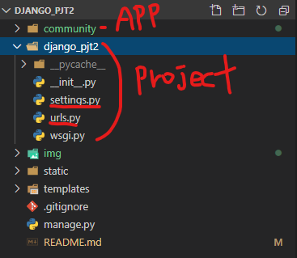
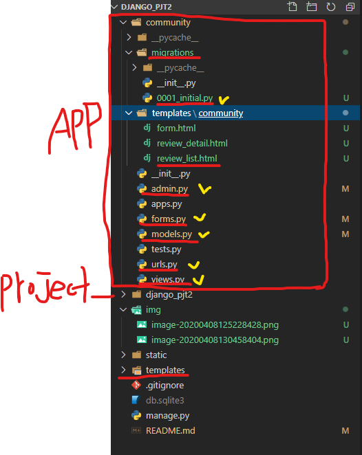

# Django 게시판 만들기 (CRUD)

## 1. 프로젝트 생성 & 앱 생성

### - 프로젝트 생성

```bash
$ django-admin startproject django_pjt2
```


### - 앱 생성

- 해당 프로젝트 폴더로 들어가서 진행한다.

```bash
django_pjt2/ $ python manage.py startapp community
```




## 2. 프로젝트 설정

### - setting.py

`django_pjt2/setting.py`

```python
#1 호스트 설정
ALLOWED_HOSTS = ['*']

#2 앱 등록
INSTALLED_APPS = [
    'bootstrap4',
    'django_extensions',
    'community',
    'django.contrib.admin',
    'django.contrib.auth',
    'django.contrib.contenttypes',
    'django.contrib.sessions',
    'django.contrib.messages',
    'django.contrib.staticfiles',
]

# 템플릿 경로설정
TEMPLATES = [
    {
        'BACKEND': 'django.template.backends.django.DjangoTemplates',
        'DIRS': [
            os.path.join(BASE_DIR, 'templates')
        ],

# 한국어 설정        
LANGUAGE_CODE = 'ko-kr'

# 시간설정        
TIME_ZONE = 'Asia/Seoul'
        
# 정적파일 경로설정        
STATIC_URL = '/static/'
STATICFILES_DIR = [
    os.path.join(BASE_DIR, 'static'),
]     
```


### - urls.py

`django_pjt2/urls.py`

```python
from django.contrib import admin
from django.urls import path, include

urlpatterns = [
    path('admin/', admin.site.urls),
    path('community/', include('community.urls')),
]
```

- `include`  추가 import
- `community` 앱 url 경로 추가




## 3. Community App 설정

### - templates/community/

- `community` 앱이 쓰게 될 `templates` 공간이다.


### - urls.py

- 따로 community 폴더아래에 `urls.py` 파일을 생성

- `community/` 로 들어온후의 경로를 설정하는 곳이다. 
- `app_name = "community"` 추가
- `path` 에 `name` 을 줘서 해당 `url` 에 이름을 준다.

```python
from django.urls import path
from . import views

app_name = "community"

# community/
urlpatterns = [
    path('', views.review_list, name="review_list"),
]
```


### - views.py

- `urls.py` 경로를 통해 들어오면 함수가 실행될 `controller` 역할을 한다.

```python
from django.shortcuts import render

# Create your views here.
def review_list(request):
    pass
```


### - models.py

- `DB` 에 반영될 `Table` 을 만드는 공간이다.
- `Review` 라는 이름의  `Table` 을 만든다.
  - `'title', 'movie_title', 'rank', 'content', 'created_at', 'updated_at'`  컬럼을 만든다.

```python
from django.db import models

# Create your models here.
class Review(models.Model):
    title = models.CharField(max_length=100)
    movie_title = models.CharField(max_length=30)
    rank = models.IntegerField()
    content = models.TextField()
    created_at = models.DateTimeField(auto_now_add=True)
    updated_at = models.DateTimeField(auto_now=True)
```


**model 적용**

- 위에서 만든 `models.py` 의 내용들을 `DB` 에 반영하기 위해서는 `2가지의 명령` 을 실행해야 한다.

  1. ```bash
     $ python manage.py makemigrations
     ```

     - `Table` 버전관리, `DB` 에 반영될 Table 설계도를 만든다.
     - `community/migrations/` 폴더에 설계도가 생성된다.

     

  2. ```bash
     $ python manage.py migrate
     ```

     - 만들어진 설계도를 `DB`  에 반영하여 `실제로 Table` 을 만든다.


### - forms.py

- 위에서 정의한 모델 `Review` 의 데이터 검증, 저장, 에러메시지, HTML을 모두 관리하기 위해
  `ModelForm` 을 사용한다.
- 해당 `ModelForm` 은 아래의 필드를 검증 및 HTML 로 표시한다.
  - `title, movie_title, rank, content`

```python
from django import forms
from .models import Review # models.py 에서 정의한 Review 클래스를 사용


class ReviewForm(forms.ModelForm):
    class Meta:
        model = Review
        fields = ['title', 'movie_title', 'rank', 'content']
        # fields = '__all__'
```


### - admin.py

- 위에서 정의한 모델 `Reivew` 는 관리자 페이지에서 데이터를 `생성, 조회, 수정, 삭제` 가능해야 한다.
- `admin.site.register(Review)` 명령어를 통해 Review 를 등록한다.

```python
from django.contrib import admin
from .models import Review

# Register your models here.
# 해당 부분은 admin 페이지에서 좀 더 깔끔하게 보기 위해서 작성함.
class ReviewAdmin(admin.ModelAdmin):
    list_display = ['id', 'title', 'movie_title', 'rank', 'content', 'created_at', 'updated_at']

admin.site.register(Review, ReviewAdmin)
```


**Super User 생성**

- admin 페이지에 로그인하기 위해서는 `superuser` 가 있어야한다.
- `python manage.py createsuperuser` 명령어를 통해 만든다.

```bash
$ python manage.py createsuperuser
```




## 4. CRUD 구현

### - Create

`community/urls.py`

```python
from django.urls import path
from . import views

app_name = "community"

# community/
urlpatterns = [
    path('', views.review_list, name="review_list"),
    path('create/', views.review_create, name="review_create"),
]
```


`community/views.py`

```python
from django.shortcuts import render, redirect, get_object_or_404
from .forms import ReviewForm
from .models import Review


# Create your views here.
def review_list(request):
    reviews = Review.objects.all()
    context = {
        'reviews': reviews,
    }
    return render(request, 'community/review_list.html', context)

def review_create(request):
    if request.method == 'POST':
        form = ReviewForm(request.POST)
        if form.is_valid():
            article = form.save()
            return redirect('community:review_list')
    else:
        form = ReviewForm()
    context = {
        'form': form
    }
    return render(request, 'community/form.html', context)
```


`community/templates/community/form.html`

```django




  
  <h1>게시글 수정</h1>
  <hr>
  
  <h1>게시글 작성</h1>
  <hr>
  
  
  <form method="post">
    
    
    <input class="btn btn-primary" type="submit" value="완료">
  </form>

```


### - Read

`community/urls.py`

```python
from django.urls import path
from . import views

app_name = "community"

# community/
urlpatterns = [
    path('', views.review_list, name="review_list"),
    path('create/', views.review_create, name="review_create"),
    path('<int:pk>/', views.review_detail, name="review_detail"),
]
```


`community/views.py`

```python
def review_detail(request, pk):
    review = get_object_or_404(Review, pk=pk)
    context = {
        'review': review
    }
    return render(request, 'community/review_detail.html', context)
```


`community/templates/community/review_detail.html`

```django



  <h1 class="col-12 text-center mt-3">게시글 상세보기</h1>
  <hr>

  <!-- Card -->
  <div class="card text-center">
    <div class="card-header bg-dark text-white">
      {{ review.title }}
    </div>
    <div class="card-body">
      <h5 class="card-title">{{ review.movie_title }}</h5>
      <p class="card-text">{{ review.content }}</p>
      <p> Rank : {{ review.rank }} </p>
    </div>
    <div class="card-footer text-white bg-dark">
      작성일 : {{ review.created_at }}<br>
      수정일 : {{ review.updated_at }}
    </div>
  </div>

  <div class="d-flex justify-content-end">
    <a href="" class="btn btn-primary">수정</a>
    <form action="" method="post">
      
      <input type="submit" class="btn btn-danger" value="삭제">
    </form>
  </div>

```


### - Update

`community/urls.py`

```python
from django.urls import path
from . import views

app_name = "community"

# community/
urlpatterns = [
    path('', views.review_list, name="review_list"),
    path('create/', views.review_create, name="review_create"),
    path('<int:pk>/', views.review_detail, name="review_detail"),
    path('<int:pk>/update', views.review_update, name="review_update"),
]
```


`community/views.py`

```python
def review_update(request, pk):
    review = get_object_or_404(Review, pk=pk)
    if request.method == 'POST':
        form = ReviewForm(request.POST, instance=review)
        if form.is_valid():
            review = form.save()
            return redirect('community:review_detail', review.pk)
    else:
        form = ReviewForm(instance=review)
    context = {
        'form': form
    }
    return render(request, 'community/form.html', context)
```


`community/templates/community/form.html`

- 해당부분은 `create` 와 `update` 가 공동의 `form.html` 을 사용하고있으므로 코드가 같다.
- 즉 `create` 부분의 `form.html` 와 코드가 같으므로 생략한다.


### - Delete

`community/urls.py`

```python
from django.urls import path
from . import views

app_name = "community"

# community/
urlpatterns = [
    path('', views.review_list, name="review_list"),
    path('create/', views.review_create, name="review_create"),
    path('<int:pk>/', views.review_detail, name="review_detail"),
    path('<int:pk>/update', views.review_update, name="review_update"),
    path('<int:pk>/delete', views.review_delete, name="review_delete"),
]
```


`community/views.py`

- `delete` 기능은 따로 html 파일이 없고 기능만 수행하게 된다.
- `delete` 기능은 `http POST` 요청으로 들어왔을때에만 기능을 수행해야 하므로
  `@require_POST` 을 작성해줘야 한다.

```python
from django.views.decorators.http import require_POST

@require_POST
def review_delete(request, pk):
    review = get_object_or_404(Review, pk=pk)
    review.delete()
    return redirect('community:review_list')
```


### - CRUD 전체 views.py

`views.py`

```python
from django.shortcuts import render, redirect, get_object_or_404
from django.views.decorators.http import require_POST
from .forms import ReviewForm
from .models import Review


# Create your views here.
def review_list(request):
    reviews = Review.objects.order_by('-pk')
    context = {
        'reviews': reviews,
    }
    return render(request, 'community/review_list.html', context)

def review_create(request):
    if request.method == 'POST':
        form = ReviewForm(request.POST)
        if form.is_valid():
            article = form.save()
            return redirect('community:review_list')
    else:
        form = ReviewForm()
    context = {
        'form': form
    }
    return render(request, 'community/form.html', context)

def review_detail(request, pk):
    review = get_object_or_404(Review, pk=pk)
    context = {
        'review': review
    }
    return render(request, 'community/review_detail.html', context)

def review_update(request, pk):
    review = get_object_or_404(Review, pk=pk)
    if request.method == 'POST':
        form = ReviewForm(request.POST, instance=review)
        if form.is_valid():
            review = form.save()
            return redirect('community:review_detail', review.pk)
    else:
        form = ReviewForm(instance=review)
    context = {
        'form': form
    }
    return render(request, 'community/form.html', context)

@require_POST
def review_delete(request, pk):
    review = get_object_or_404(Review, pk=pk)
    review.delete()
    return redirect('community:review_list')
```


